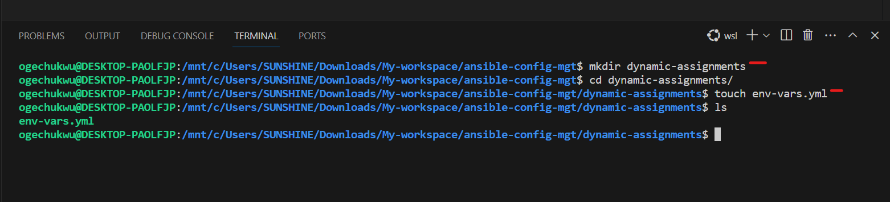
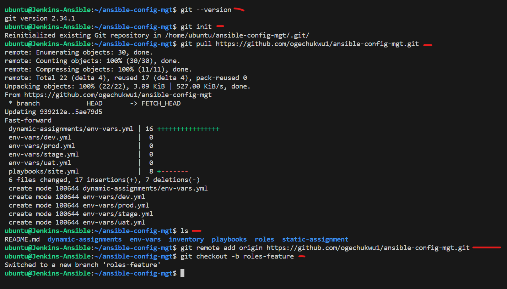
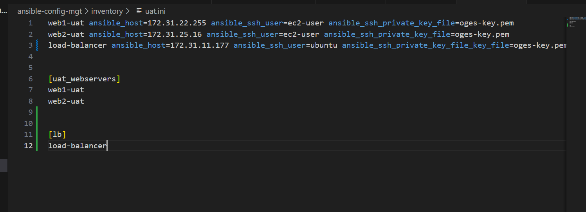

# ANSIBLE-DYNAMIC-ASSIGNMENTS
## Ansible Dynamic Assignments (include) And Community Roles


Ansible is an actively developing software project, so you are encouraged to visit [Ansible documentation](https://docs.ansible.com/) for the latest updates on modules and their usage.


Ansible is a popular open-source configuration management and automation tool that is used for various IT tasks such as configuration management, application deployment, and orchestration. One of the key features of Ansible is its ability to use variables to store and manipulate data. These variables can be defined in various ways and can be used to perform dynamic assignments in ansible playbooks.

Dynamic assignments in ansible refer to the use of variables whose values are calculated or determined at runtime. This is in contrast to static assignments, where the values of variables are defined and fixed at the time of writing the playbook. Dynamic assignments are useful in scenarios where the values of variables need to be determined based on certain conditions or inputs.


Ansible has two modes of operation for reusable content: __dynamic and static__.


In this project we will introduce __dynamic assignments__ by using __include module__. The difference between __static__ and __dynamic__ assignment is that static assignments uses __import__ module while dynamic assignment uses __include__ module. 


_Static=import_

_Dynamic=include_


- All `import*` statements are pre-processed at the time playbooks are [parsed](https://en.wikipedia.org/wiki/Parsing). Meaning, when you excute `site.yml` playbook, Ansible will process all the playbooks referenced during the time it is parsing the statement. It also means during actual execution, if any statement changes, such statements will no be considered. Hence its static.

- All `include*` statements are processed at the point in which that task is encountered during the execution of the current playbook. Meaning after all the statement are [parsed](https://en.wikipedia.org/wiki/Parsing), any changes to the statemnets encountered during execution will be used. 


In most cases its recommended to use static assignments for playbooks, because its more reliable. With dynamic ones its hard to debug playbook problems due to its dynamic nature. However, you can use dynamic assignments for environment specific variables as we will be introducing in this project. 


If you use any `include*` Task (include_tasks, include_role, etc.), it will be **dynamic**. If you use any `import*` Task (import_playbook, import_tasks, etc.), it will be __static__.


Ansible include module is used to include a file with a list of plays or tasks to be executed in the current playbook and it can be a single include file the multiple include files, meaning it calls the other playbooks tasks.


You should use `import` when you deal with logical "units". For example, separate long list of tasks into subtask files.

But you would use `include` to deal with different workflows and take decisions based on some dynamically gathered facts.


## __Introducing dynamic assignments into our structure__


In your [ansible config mgt](https://github.com/ogechukwu1/ansible-config-mgt) GitHub repository create a new branch and call it `dynamic-assignments` 


Create a new directory and name it __dynamic-assignments__. Then inside this directory, create a new file __env-vars.yml__. We will instruct __site.yml__ to include this playbook later. For now, let us keep building up the structure.





We will be using the same Ansible to configure multiple environments and each of these environments will have certain unique attributes, such as __servername__ and __ip-address__ etc. We will set values to variables per specific environment.

We will create a directory to keep each environment’s variables file.

Create a new directory __env-vars__, then for each environment create new __YAML__ files which we will use to set variables.


Now paste this snippet below into the `env-vars.yml` file.


```
---
- name: collate variables from env specific file, if it exists
  hosts: all
  tasks:
    - name: looping through list of available files
      include_vars: "{{ item }}"
      with_first_found:
        - files:
            - dev.ini
            - stage.ini
            - prod.ini
            - uat.ini
          paths:
            - "{{ playbook_dir }}/../env-vars"
      tags:
        - always

```


__Notice 3 things here:__

We used __include_vars__ module instead of __include__. This is because Ansible developers decided to separate different features of the module. From Ansible version 2.8, the include module is deprecated and variants of _include*__ must be used. These are:

- [include_role](https://docs.ansible.com/ansible/latest/collections/ansible/builtin/include_role_module.html#include-role-module).

- [include_tasks](https://docs.ansible.com/ansible/latest/collections/ansible/builtin/include_tasks_module.html#include-tasks-module).

- [include_vars](https://docs.ansible.com/ansible/latest/collections/ansible/builtin/include_vars_module.html#include-vars-module).

In the same version, variants of import were also introduced such as:

- [import_role](https://docs.ansible.com/ansible/latest/collections/ansible/builtin/import_role_module.html#import-role-module)

- [import_tasks](https://docs.ansible.com/ansible/latest/collections/ansible/builtin/import_tasks_module.html#import-tasks-module)


We made use of a [special variables](https://docs.ansible.com/ansible/latest/reference_appendices/special_variables.html) `{{ playbook_dir }}` and `{{ inventory_file }}`. `{{ playbook_dir }}` will help Ansible to determine the location of the running playbook, and from there navigate to other path on the filesystem. `{{ inventory_file }}` on the other hand will dynamically resolve to the name of the inventory file being used, then append `.yml` so that it picks up the required file within the __env-vars__ folder.

 We are including the variables using a loop.`with_first_found` implies that, looping through the list of files, the first one found is used. This is good so that we can always set default values in case an environment specific env file does not exist.


__UPDATE SITE.YML WITH DYNAMIC-ASSIGNMENTS__


Update __site.yml__ file to make use of the dynamic assignment with the instruction below:

__site.yml__ should now look like this.

```
---
- name: Include dynamic variables
  hosts: all 
  tasks:
- import_playbook: ../static-assignment/common.yml 
  include: ../dynamic-assignments/env-vars.yml
  tags:
    - always
    
- name: uat_webserver configurations
  hosts: uat_webservers
- name: uat_Webserver assignment
  import_playbook: ../static-assignment/uat_webservers.yml

```


Let's create a role for MYSQL database-it should install MYSQL package, create database and configure users. There are tons of roles that have already been developed by other open source engineers out there. These roles are actually production ready, and dynamic to accomodate most of linux flavours. With Ansible Galaxy, we can simply download a ready to use ansible role.


__Download MYSQL Ansible role__

You can browse available community roles [here](https://galaxy.ansible.com/ui/)


We will be using [MYSQL role](https://galaxy.ansible.com/ui/standalone/roles/geerlingguy/mysql/) developed by __gerlingguy__.


__Hint:__ To preserve your GitHub in actual state after you install a new role-make a commit and push to master your 'ansible-config-mgt' directory. 

We have to install `git` on `Jenkins-Ansible` server and then configure Visual Studio Code to work with this directory.

Jenkins job and webhook will no longer be needed

On `jenkins Ansible` server make sure git is installed with `git --version` then go to `ansible-config-mgt` and run.


`git init`

`git pull https://github.com/ogechukwu1/ansible-config-mgt.git`

`git remote add origin https://github.com/ogechukwu1/ansible-config-mgt.git`

`git checkout -b roles-feature` switching into roles-feature branch





Inside `role` directory create your new MYSQL role with `ansible-galaxy init geerlingguy.mysql` and rename the folder to `mysql`


cd into `role` directory

`cd roles`

create the  __MYSQL role__ using ansible-galaxy

`ansible-galaxy role install geerlingguy.mysql`


Rename the __MYSQL role__

`mv geerlingguy.mysql/ mysql`


Read `README.md` file, and edit roles configuration to use correct credentials for MYSQL required for the `tooling` website.


Edit the __defaults/main.yml__ in the Mysql role


Now upload the changes into your Github

`git add .`

`git commit -m "Commit new role files into GitHub"`

`git push --set-upstream origin roles-feature`


Make a commit and push the roles-feature branch and merge to main branch.


Then create a pull request and merge to the main branch if we are satisfied with your codes.


__LOAD BALANCER ROLES__

We want to be able to choose which Load Balancer to use, __Nginx or Apache__, so we need to have two roles respectively:

- Nginx

- Apache

We will create roles for __Nginx__ and __Apache__ from the community roles.

Copy the link for the roles


Create the roles in the __roles directory__.

`ansible-galaxy install geerlingguy.nginx`

`ansible-galaxy install geerlingguy.apache`


Rename roles to __Nginx__ and __Apache__ respectively.

`mv geerlingguy.nginx/ nginx`

`mv geerlingguy.apache/ apache`


Since you cannot use both __Nginx__ and __Apache__ as load balancer, you need to add a condition to enable either one- this is where you can make use of variables.

Declare a variable in the __defaults/main.yml__ file inside the __Nginx__ and __Apache roles__, we will declare a variable and name each variables `enable_nginx_lb` and `enable_apache_lb` respectively 

set both variables to __false__ like this `enable_nginx_lb: false` and `enable_apache_lb: false`.

Declare another variable in both roles `load_balancer_is_required` and set it's value to `false` as well


```
enable_nginx_lb: false
load_balancer_is_required: false

enable_apache_lb: false
load_balancer_is_required: false

```


For Nginx


For Apache


Update both assignments directory and site.yml files respectively

In the static assignments directory, create a file `loadbalancers.yml` file


Paste the snippet in the `loadbalancers.yml` file


```
- hosts: lb
  roles:
    - { role: nginx, when: enable_nginx_lb and load_balancer_is_required }
    - { role: apache, when: enable_apache_lb and load_balancer_is_required }

```


Then update the __playbooks/sites.yml__ file with the snippet


```
- name: Loadbalancers assignment
- hosts: lb
- import_playbook: ../static-assignment/loadbalancers.yml
  when: load_balancer_is_required

```


Now we can make use of `env-vars\uat.ini` file to define which loadbalancer to use in __UAT__ environment by setting respective environmental variable to `true`.

You will activate load balancer, and enable nginx by setting these in the respective environments env-vars file.


```
enable_nginx_lb: true
load_balancer_is_required: true

enable_apache_lb: false
load_balancer_is_required: false

```


The same must work with apache LB, so you can switch it by setting respective environmental variable to `true` and other to `false`.


We update the inventory/uat.ini





Then Check if the ansible can acess the inventory

`ansible all -m ping -i inventory/uat.ini`


Push the dynamic assignment branch and merge and also create a pull request


Then run the playbook


`ansible-playbook playbooks/site.yml -i inventory/uat.ini`


We have learned how to use Ansible configuration management tool to prepare UAT environment for tooling web solution.


